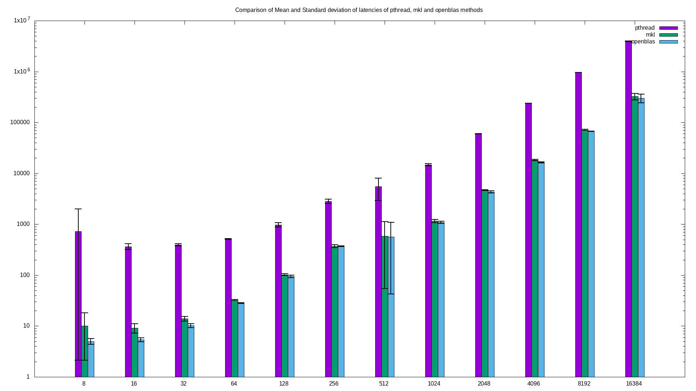

## Image Processing Library
### Compilation:
	Change the value of MKLROOT variable in makefile to your mkl library folder. 
	Open a terminal in the repo directory and type: 	make all

### Assumption:
	Stride = 1
	Input Matrix size = [nxn]
	Filter size = [fxf]
	Padding = p
	Input Vector size = n

#### Implemented Functions - 
**computeConv0**: Evaluates convolution of a square matrix with a given square kernel using normal convolution method.
*Output matrix dimensions* = [(n + 2p - f + 1)x(n + 2p - f + 1)]  
*Usage:*	`./all conv0 padding_size input_matrix_file input_matrix_size kernel_file kernel_matrix_size`

**computeConv1**: Evalutes convolution of a square matrix with a given square kernel by multiplying the Teoplitz matrix and the flipped kernel.  
*Output matrix dimensions* = [(n + 2p - f + 1)x(n + 2p - f + 1)]  
*Usage:*	`./all conv1 padding_size input_matrix_file input_matrix_size kernel_file kernel_matrix_size`

**relu**: Activates the input matrix using Rectified Linear Unit function.  
*Output matrix dimensions* = [nxn]  
*Usage:*
	`./all relu input_matrix_file input_matrix_size`

**tanh**: Activates the input matrix using hyperbolic tan function.  
*Output matrix dimensions* = [nxn]  
*Usage:*
	`./all tanh input_matrix_file input_matrix_size`

**maxpool**: Evaluates the maxpool matrix for a given input matrix. We assume the filter matrix to be a square matrix of dimensions [fxf].  
*Output matrix dimensions* = [(n + 2p - f + 1)x(n + 2p - f + 1)]  
*Usage:* 
	`./all maxpool padding_size input_matrix_file input_matrix_size filter_size`

**avgpool**: Evaluates the avgpool matrix for a given input matrix. We assume the filter matrix to be a square matrix of dimensions [fxf].  
*Output matrix dimensions* = [(n + 2p - f + 1)x(n + 2p - f + 1)]  
*Usage:*
	`./all avgpool padding_size input_matrix_file input_matrix_size filter_size`

**sigmoid**: Activates the input vector using sigmoid function.  
*Usage:*
	`./all sigmoid input_vector_file input_vector_size`

**softmax**: Activates the input vector using softmax function.  
*Usage:*
	`./all softmax input_vector_file input_vector_size`

**Available methods for Matrix multiplication: ['MKL', 'OPENBLAS', 'PThreads']**  
*Usage*:
```
./all conv0 padding_size input_matrix_file input_matrix_size kernel_file kernel_matrix_size mkl
./all conv0 padding_size input_matrix_file input_matrix_size kernel_file kernel_matrix_size openblas
./all conv0 padding_size input_matrix_file input_matrix_size kernel_file kernel_matrix_size pthread
```
*for comparing matrix multiplication performance use:*
```
	 make performance
	 gnuplot plot.plt
```


